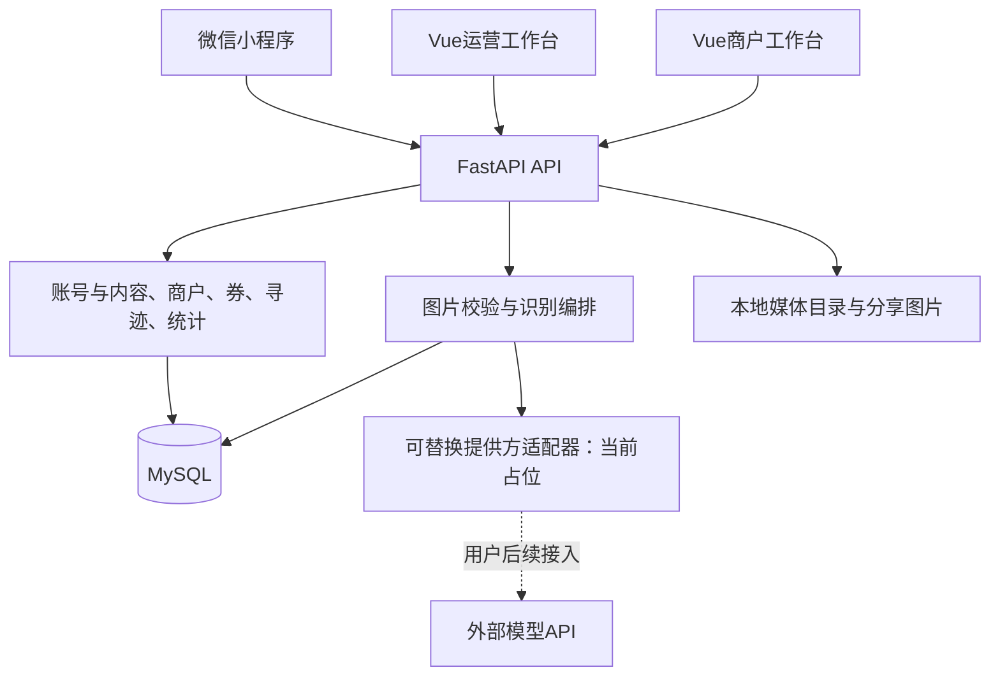

# 系统结构

当前结构为一个模块化业务后端、一个按角色划分的Web工作台和原生微信小程序。首期调用外部模型的边界已建立，服务商适配保留占位；数据库按用户要求使用MySQL。

## 模块与存储

| 位置 | 已实现职责 |
| --- | --- |
| `backend/app/business/` | 账号会话、角色、字典及审核、商户/商品/活动、优惠券、任务、收藏、历史、纠错、统计和导出 |
| `backend/app/main.py`、`recognition.py` | 请求追踪、运行状态、隐私信息、图片质量检查、候选过滤及识别记录 |
| `backend/app/provider_factory.py` | 用户后续实现提供方协议的唯一装配入口 |
| `backend/app/media.py` | 媒体上传与访问、生成海报及微信分享码集成 |
| `backend/app/maintenance.py` | 识别、反馈、事件、会话和未引用媒体的保留期清理 |
| `web/` | Vue 3、TypeScript、Element Plus共享工作台，运营与商户独立路由和菜单 |
| `miniprogram/` | 18个原生业务页面，调用后端及微信相机、地图、保存和分享能力 |
| `backend/migrations/` | Alembic版本化迁移，当前版本见迁移目录与交付记录 |

MySQL采用InnoDB和utf8mb4；业务表使用精确字符串排序规则，连接采用READ COMMITTED。身份、会话、券库存、领取、核销、任务参与、印记和事件使用关系表；字典、商户等内容以类型校验后的JSON保存在带状态和归属索引的内容表。详细事务和接口语义见 [业务实施约定](contracts/business-implementation.md)。SQLite只用于隔离测试。

当前媒体存储为 `runtime/media` 文件及元数据，Docker方案使用持久卷。尚未接入对象存储或Redis，它们不是本轮业务运行依赖。

## 识别与文化内容

1. 登录用户上传相机或相册图片，服务端检查类型、大小、可解码性及基本质量。
2. 从MySQL读取已发布字典，交给提供方适配器进行候选ID映射。
3. 只保留已发布词条；释义、来源和字形均来自审核内容，模型输出不能自行成为文化故事。
4. 候选结果要求用户确认；无可靠候选返回未知状态，超时或未配置保留明确失败状态。
5. 保存请求、提供方、版本、耗时和候选元数据；确认及纠错始终绑定本人原请求。

按照D-013，当前工厂返回未配置提供方。环境变量只是配置入口，必须补充具体适配器后才能发起真实识别。本轮不建设训练流水线、GPU服务或自动重训练。

## 业务流程

文化词条关联已审核商户后进入推荐，结合距离、有效优惠、运营设置和用户兴趣排序。游客领取优惠券，商户核销，系统记录转化及来源。任务支持识字、扫码、围栏、核销和运营人工确认，完成后生成印记及奖励。无奖励库存时保留已完成进度，允许重试领取奖励。

海报限定本人已收藏或确认识别的1至3个已发布词条，使用真实字形生成PNG；微信码配置不足时明确标记缺失。当前不持久化游客识别原图；后台上传的文化图片和生成图片由媒体模块管理。

## 当前验收口径

按D-015，以页面操作、接口联调和业务数据变化作为本轮交付依据。已有权限、事务、日志和校验继续保留，后续正式环境的性能、可用性与设备测试单独安排。真实资料、微信账号和模型接入的状态见 [交付边界](release.md)，不由测试数据替代。
